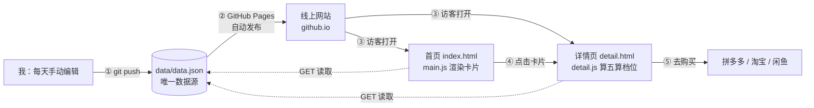

# TECH_DESIGN.md ｜「高达行情」· 技术设计文档

> Day 5 产出 · 2026-09-20
> 依据：PRD.md（Day 4 产出）
> 硬约束：电脑配置不高（可装软件）；每天约 2 小时；零费用优先；尽量不注册新账号

## 1. 技术路线（一句话）

> **采用纯静态方案：HTML/CSS/JS 前端直接读取 `data.json`，部署在 GitHub Pages，零费用、零后端；`data.json` 的字段按未来可迁移到数据库的方式设计。**

## 2. 方案比较与选型理由

| 维度 | 方案 A：纯静态网页 | 方案 B：前端 + 后端 API + 数据库 |
|---|---|---|
| 学习成本 | **低**：只需 HTML/CSS/JS | 高：还要学后端语言、API 设计、数据库 |
| 线上持久化 | 数据随 git 提交永久保存、自带历史；改数据需本地改文件再推送 | 数据在云端可在线改，可做管理后台 |
| 费用 | **0 元**，GitHub Pages 免费托管 | 免费档可用，但需注册约 2 个云服务账号 |
| 排错难度 | **低**：只有 JS 错误和 JSON 格式错误两类，F12 可见 | 高：前端/后端/数据库/部署四层都可能出错 |

**选方案 A 的理由：**

1. PRD 本期功能（3 台机体、每天手动更新、无登录无下单）用不到数据库的优势，选 B 是杀鸡用牛刀；
2. 每天 2 小时的节奏下，A 能保证交付，B 光环境搭建就可能占掉两天；
3. A 零费用、零新账号，B 要走云服务注册流程；
4. A 的出错面最小，适合新手排错；
5. 迁移路径已留：`data.json` 字段按数据库表结构设计（见第 11 节），v2 升级时数据可整体平移。

## 3. 前后端与数据库分工（本期形态）

| 层 | 本期由谁承担 | 说明 |
|---|---|---|
| 前端 | `index.html` + `detail.html` + JS | 负责全部展示：列表、卡片、价格表、跳转链接 |
| 后端 | **无** | 无登录、无下单、无自动抓取，后端无事可做 |
| 数据库 | **无 DBMS**，由 `data/data.json` 承担仓库角色 | 每天手动编辑一次，git 历史即备份 |

## 4. 项目结构

```
vibecoding打卡project/
├── index.html        # 首页：机体列表（3 张卡片 + 数据更新时间 + 页脚说明）
├── detail.html       # 详情页：单台机体价格参照与渠道比价（URL 参数传 id）
├── css/
│   └── style.css     # 全站样式（含手机端适配）
├── js/
│   ├── main.js       # 首页逻辑：读取 data.json、渲染卡片
│   └── detail.js     # 详情页逻辑：读 id、渲染详情、计算行情档位
├── data/
│   └── data.json     # 唯一数据源，每天手动编辑（字段见第 5 节）
├── PRD.md            # Day 4 产出
├── TECH_DESIGN.md    # 本文档（Day 5 产出）
├── AGENTS.md         # 协作规则
└── research*.md      # Day 1~3 产出
```

## 5. 数据对象及字段

### 5.1 顶层结构（`data/data.json`）

| 字段 | 类型 | 必填 | 说明 |
|---|---|---|---|
| `meta.updatedAt` | string | 是 | 数据更新日期，格式 `2026-09-20`，页面顶部展示 |
| `meta.exchangeRate` | number | 是 | 日元→人民币汇率（如 `0.048`），全局一份，五算计算用 |
| `kits` | array | 是 | 机体数组，本期固定 3 台 |

### 5.2 机体对象（`kits[]` 每一项）

| 字段 | 类型 | 必填 | 说明 |
|---|---|---|---|
| `id` | string | 是 | 英文小写标识，用于详情页 URL 参数，如 `mg-freedom-2` |
| `name` | string | 是 | 机体名，如 `MG 自由 2.0` |
| `series` | string | 是 | 系列，本期均为 `MG`（强袭自由为 `MGEX`） |
| `officialPriceJPY` | number | 是 | 日本官方建议零售价（日元） |
| `image` | string | 否 | 图片文件名，缺省时页面用文字占位 |
| `channels` | array | 是 | 渠道现价列表，每台至少 1 条，可为空数组 |

### 5.3 渠道价格对象（`channels[]` 每一项）

| 字段 | 类型 | 必填 | 说明 |
|---|---|---|---|
| `platform` | string | 是 | 枚举：`pdd`（拼多多）/ `taobao`（淘宝）/ `xianyu`（闲鱼） |
| `marketType` | string | 是 | 枚举：`行货` / `水货`，分行展示不混算 |
| `price` | number | 是 | 现价（人民币元）；暂无报价填 `null` |
| `updatedDate` | string | 是 | 该条价格的录入日期 |
| `url` | string | 否 | 「去购买」跳转链接（平台搜索页或商品页） |

### 5.4 派生值（不存文件，由 JS 计算）

- **五算基准价** = `officialPriceJPY × 0.05 × meta.exchangeRate`（例：4500 日元、汇率 0.048 → 约 216 元）
- **行情档位**：最低现价 < 五算基准 → 「捡漏」；五算基准 ~ 1.2 倍 → 「合理」；> 1.2 倍 → 「溢价」
- 注：五算公式对冷门限定款不适用（PRD 已声明，页面页脚说明）

## 6. API 列表

**本期没有自建后端，因此没有自建 API。** 前端消费的全部「数据接口」如下：

| 接口 | 方法 | 用途 | 说明 |
|---|---|---|---|
| `data/data.json` | GET | 首页、详情页启动时读取全部数据 | 静态文件请求，GitHub Pages 直接返回 |
| 各平台购买链接 | GET | 「去购买」跳转 | 外部平台页面，非本站接口，本站只负责跳转 |

v2 若升级后端，预留接口（本期仅占位设计，不实现）：`GET /api/kits`（机体列表）、`GET /api/kits/{id}`（单台详情）。

## 7. 数据流

1. **录入**：我每天在本地编辑 `data/data.json`（改价格、改 `meta.updatedAt`），git 提交并推送；
2. **发布**：GitHub 收到推送后，GitHub Pages 自动重新发布整个网站；
3. **展示**：访客浏览器打开 `index.html`，`main.js` 发起 `GET data/data.json`，渲染 3 张机体卡片和顶部更新时间；
4. **详情**：点击卡片跳 `detail.html?id=xxx`，`detail.js` 按参数筛选对应机体，渲染五算基准、三渠道×行水货价格表，并计算行情档位；
5. **跳转**：访客点「去购买」离开本站，跳到对应平台。

（数据流图见第 12 节）

## 8. 错误处理

| 场景 | 页面表现 | 处理方式 |
|---|---|---|
| `data.json` 请求失败（网络问题） | 数据区显示「数据加载失败，请刷新重试」 | JS 捕获 fetch 错误，页面不白屏 |
| `data.json` 格式错误（手改文件多逗号/漏引号） | 同上提示 | JS 捕获解析错误；编辑习惯：改完用 VS Code 或在线 JSON 校验器过一遍 |
| 某字段缺失 / `price` 为 `null` | 该行显示「暂无报价」 | 渲染前逐字段给默认值，不出现 `NaN`/`undefined` |
| 机体图片加载失败 | 显示文字占位块 | `` 的 onerror 兜底 |
| 外部购买链接失效 | 与本站无关 | 页脚免责已声明价格为快照、仅供参考 |

## 9. 环境变量

**本期没有任何环境变量。** 没有后端就没有服务器配置，没有第三方服务就没有密钥，因此不存在 `.env` 文件（也就不存在密钥入库风险）。v2 接入抓取或数据库时才会引入，届时同样不进代码、不进提交。

## 10. 部署注意事项

- **托管**：GitHub Pages，仓库 Settings → Pages → 选择 main 分支根目录，自动获得 `https://kenvin07.github.io/<仓库名>/` 网址；
- **路径必须用相对路径**：项目页部署在 `<仓库名>/` 子路径下，HTML 里引用 css/js/json 一律写 `css/style.css` 这类相对路径，不能用 `/css/style.css` 开头的绝对路径；
- **文件名全英文小写**：包括 `data.json`、图片文件，避免中文文件名在部署后出现编码问题；
- **缓存延迟**：GitHub Pages 对静态文件有约 10 分钟缓存，push 新数据后刷新页面若没变化，等几分钟或按 Ctrl+F5 强制刷新；
- **本地预览不能直接双击 HTML**：浏览器出于安全策略禁止 `file://` 页面用 fetch 读本地 JSON，本地预览需起一个极简本地服务器（VS Code 的 Live Server 插件，或 `python -m http.server`），装前者最省事。

## 11. 迁移注意事项

- **字段即未来的表结构**：`kits[]` 对应未来的「机体表」，`channels[]` 对应未来的「价格表」（一行动态现价 = 表里一行记录）——今天定好的字段名，v2 建数据库时原样平移；
- **换数据方案时受影响的文件**：`data.json`（改结构）、`main.js` / `detail.js`（改读取方式）、两个 HTML 基本不动——这是把读取逻辑集中写在 js 里而不是散在 HTML 里的原因；
- **五算与汇率**：汇率放 `meta` 全局一份而不是每台机体存一份，v2 换算逻辑只改一处；
- **升级顺序建议**：v2 先上后端 API 但仍返回相同 JSON 结构（前端零改动），再逐步迁数据库。

## 12. 数据流图



> **一句话读图（数据从哪来、到哪去）：** 数据从「我每天手动编辑」来，经 git push 存进 `data/data.json`，由 GitHub Pages 自动发布到线上；访客打开首页或详情页时，浏览器用 GET 读取这份数据渲染成页面，最后通过「去购买」跳到拼多多 / 淘宝 / 闲鱼。虚线 = 两个页面对 `data.json` 的读取动作。

> 查看方式：在 GitHub 网页端打开本文件可直接看到渲染后的图；VS Code 里需安装插件「Markdown Preview Mermaid Support」后按 Ctrl+Shift+V 预览。
